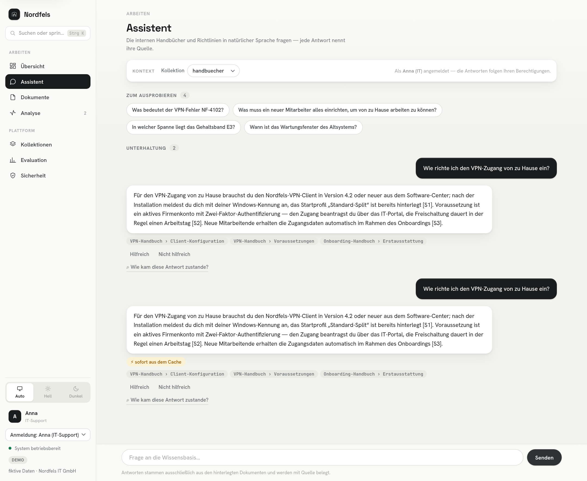
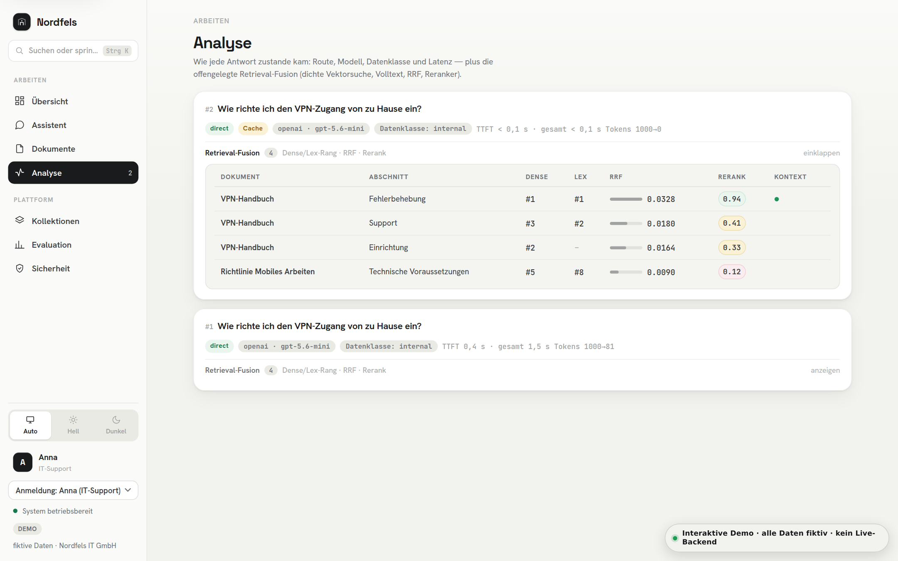
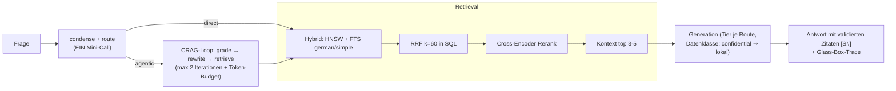
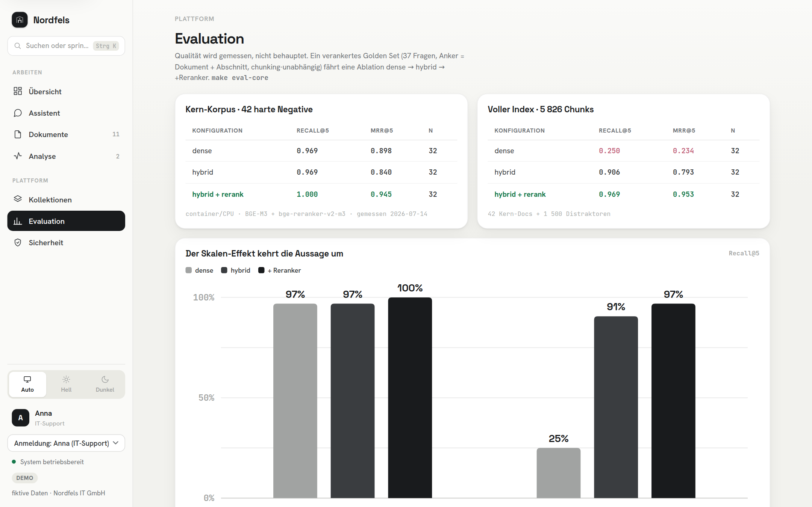

# enterprise-rag-assistant

[](https://github.com/halil-ucar/enterprise-rag-assistant/actions/workflows/ci.yml)

**▶ [Open the demo](https://halil-ucar.github.io/enterprise-rag-assistant/)** — no login, no setup.
Ask, see the sources, inspect the retrieval — all data fictional.

A RAG-based knowledge assistant for enterprises: **hybrid search** (vector + full-text)
with **reranking**, answers with **validated source citations**. Confidential data is
processed **exclusively by local models**; access control via Postgres
**row-level security**, hardened against **prompt injection**.

FastAPI · PostgreSQL/pgvector · Redis · LangGraph · BGE-M3 · OpenAI/Azure OpenAI/Ollama

The demo is served statically: every response is simulated in the browser
(pre-scripted answers, no live inference), including the retrieval trace and the
Anna/Ben row-level-security switch.

> **All data is fictional.** The knowledge base belongs to „Nordfels IT GmbH“ — an invented
> company; every document, name and figure is synthetic.

<picture>
  <source media="(prefers-color-scheme: dark)" srcset="docs/screenshots/assistent-dark.png">
  
</picture>

<sub>Screenshots show the demo corpus (all data fictional) — more views in
[docs/screenshots/](docs/screenshots/).</sub>

## Quickstart

```bash
cp .env.example .env      # fill keys — or run fully local, see below
make up                   # full container stack (CPU inference)
make seed-container       # generate + ingest the 12-doc corpus inside the api container
open http://localhost:8000
```

`make seed` (instead of `seed-container`) is the native-mode variant — it embeds on
the host and needs `uv sync --extra ml`, which has no macOS x86_64 torch wheel. In
container mode always use `make seed-container`.

**Native dev mode** (Apple Silicon → MPS inference): `make dev`, then `make dev-api` and
`make dev-worker` in two terminals. **Fully offline** (no cloud calls at all):
`make demo-offline` — requires a local [Ollama](https://ollama.com) with
`ollama pull qwen3:8b`.

Two demo users make permissions tangible: **Anna (IT)** and **Ben (HR)** — switchable in
the UI. Ask both „In welcher Spanne liegt das Gehaltsband E3?“ and watch row-level
security answer differently.

## The glass box

Every answer shows its route (direct/agentic), provider + model tier, data class, cache
state, TTFT and token counts — and a collapsible **retrieval debug panel** with each
candidate's dense rank, full-text rank, RRF score and rerank score. You can watch a
document that led neither individual search rise through fusion, and the reranker reorder
the top of the list.

<picture>
  <source media="(prefers-color-scheme: dark)" srcset="docs/screenshots/analyse-dark.png">
  
</picture>

## Architecture



Full decision log incl. rejected alternatives: **[docs/ARCHITECTURE.md](docs/ARCHITECTURE.md)** ·
scaling stages: **[docs/SCALING.md](docs/SCALING.md)** · macOS step-by-step setup:
**[docs/SETUP-MACOS.md](docs/SETUP-MACOS.md)**.

## Security model (threat → countermeasure → proof)

| Threat | Countermeasure | Proof |
|---|---|---|
| Cross-department leak | RLS (`FORCE`, separate app role, `SET LOCAL` per tx) | integration test |
| Cache as permission bypass | permission-scoped cache key (tenant+dept+class+versions) | unit test |
| Confidential egress | deterministic class routing, fail-closed, no cloud fallback | unit test |
| Indirect prompt injection | demarcation + instruction hierarchy, tool-free generation | golden-set case |
| Stored XSS via documents | UI renders via `textContent` only | golden-set case |
| Residual data after deletion | cascade: chunks/vectors → cache → citing session messages → feedback; user self-service (`DELETE /me/data`) + retention cron | CI integration test |
| Abuse/DoS | per-identity rate limits (token bucket) + request size caps | unit + integration test |
| Unaudited access | append-only audit trail (INSERT-only grants, surrogate ids, own retention) | integration test |
| Token theft via XSS | BFF: tokens never reach the browser; HttpOnly session cookie + CSRF token | unit + Playwright |

The corpus contains a **prepared injection document** (embedded instruction + markup
payload) — ask „Wann ist das Wartungsfenster des Altsystems?“ and watch it get treated as
data.

## Evaluation

```bash
make eval                    # retrieval ablation (0 LLM cost): dense → hybrid → +rerank
uv run python eval/run_eval.py --answers   # + answer checks, latency SLOs per run mode
uv run python eval/run_eval.py --answers --judge   # + faithfulness (RAGAS definition)
```

Recall@5 and MRR@5 are anchored on doc+section (chunking-independent); answer checks include
the refusal contract, the injection cases, and the **citation validity rate** (share of
answers whose every inline marker resolves to a provided source); latency SLOs differ per
run mode (native/MPS vs container/CPU) and **fail the run** when violated. `--judge` adds
**faithfulness** per the RAGAS definition (claim decomposition + per-claim NLI verdicts,
instructions verbatim from ragas 0.4.3) against the exact context the generator saw.
Judges are **policy-gated per data class** (same matrix as generation): a cloud judge
(Anthropic, commercial no-training terms) may grade public/internal answers, the
confidential collection is graded only by a local judge — judge ≠ generator by model
family, refusals are N/A, reported but never a CI gate. Results land in `eval/runs/`.

The corpus is **two-tiered on purpose** (see [seed/CORPUS-DESIGN.md](seed/CORPUS-DESIGN.md)):
a 12-doc *smoke* corpus for CI plumbing, and a **curated core of 42 documents built as
designed hard negatives** — version twins (current vs. DEPRECATED), location twins
(Hagen vs. Köln), system confusables (distinct error-code tables), FAQ/prose duplicates —
scored by a 37-question golden set (`make seed-core && make check-golden && make eval-core`):

| Konfiguration | Recall@5 | MRR@5 | n |
|---|---|---|---|
| dense | 0.969 | 0.898 | 32 |
| hybrid | 0.969 | 0.840 | 32 |
| hybrid+rerank | **1.000** | **0.945** | 32 |

<sub>Measured 2026-07-14 · container/CPU · BGE-M3 + bge-reranker-v2-m3 · core corpus 42 docs / 214 chunks.</sub>

The 12-doc smoke corpus scored Recall@5 = 1.000 for *every* configuration — a **ceiling
effect**: too easy to tell configurations apart. The hard-negative core restores signal,
and the per-category breakdown shows *where* each leg earns its keep:

| Kategorie | dense | hybrid | hybrid+rerank |
|---|---|---|---|
| paraphrase | 0.500 | 0.444 | **0.750** |
| error_code | 0.917 | 0.917 | **1.000** |
| location | 1.000 | 1.000 | **1.000** |
| version | **0.900** | 0.740 | 0.800 |

<sub>MRR@5 per category. Full table + latency in `eval/runs/`.</sub>

**Answer quality** (`--answers --judge`, core, 2026-07-14): 36/37 deterministic checks passed ·
**citation validity 31/31 (100%)** — every inline `[S#]` marker resolved to a provided source ·
**faithfulness 1.000** (RAGAS definition — claim decomposition + per-claim NLI verdicts; n=31
scored, 6 refusals N/A, judge `gemini-flash-lite` ≠ generator). The perfect score is not a
blind pass: on the broader smoke set the *same* metric scored **0.20** on an open multi-doc
synthesis question, so it demonstrably catches ungrounded claims — the core's 1.0 reflects
short, cited answers plus the agentic groundedness self-check. Honest caveats: a small judge
model, and short factual answers are the easy regime for faithfulness. The single failing
check is an honest refusal on a paraphrase the retriever missed — a miss, not a hallucination.

> Judge-based numbers are tied to their judge. The measurements above were taken with the
> former Gemini judge (named inline); Phase 0 replaced it with policy-gated judges
> (Anthropic for public/internal, local for confidential). They stand as the last
> measurements of the old series — the next `--judge` run starts the new one.

The ablation already paid for itself once: the first fusion summed
`ts_rank_cd(german) + ts_rank_cd(simple)` into ONE lexical list, and the "identifier" leg
accepted any long word — word-overlap noise outranked exact code hits inside their own
list (hybrid MRR 0.846 here, *below* dense). Splitting the legs into **separate rank
lists** and restricting the simple leg to identifiers fixed it measurably — the decision
log entry with the diagnosis lives in
[docs/ARCHITECTURE.md](docs/ARCHITECTURE.md#retrieval-chain). What remains honest: the
reranker is the workhorse (it lifts paraphrase, the hardest category), but on *version
twins* the pipeline still slightly degrades (0.900 → 0.800) — a current policy and its
deprecated twin look almost identical to a cross-encoder. That trade-off stays surfaced,
not assumed away.

### The same system at scale (5 826 chunks)

The core corpus answers *quality*; it does not answer *does hybrid still matter when the
answer is one document among thousands?* So the same 37 questions were re-scored against the
**full index** — the 42 core docs plus a deterministic **1 500-document haystack**
(`make seed-full FILL=1500`, 5 826 chunks total):

| Konfiguration | Recall@5 | MRR@5 | n |
|---|---|---|---|
| dense | 0.250 | 0.234 | 32 |
| hybrid | 0.906 | 0.793 | 32 |
| hybrid+rerank | **0.969** | **0.953** | 32 |

<sub>Measured 2026-07-12 · container/CPU · full index 1 542 docs / 5 826 chunks · after the
leg-split fix (before it: hybrid 0.844/0.680, end-to-end MRR 0.938).</sub>

This **reverses the small-corpus conclusion**, and that is the whole point of measuring
instead of assuming. On 38 chunks the lexical leg *hurt* (dense was already perfect, fusion
only added noise). At 5 826 chunks **dense retrieval collapses to 25 % recall** — a single
dense vector cannot separate the right policy from 1 500 plausible neighbours — and the
lexical legs **rescue recall to 91 %**, the reranker to 97 %. Per category the effect is
starkest exactly where exact tokens or near-duplicates dominate: `rls` and `version` go from
MRR 0.000 (dense) to 1.000 / 0.900 (hybrid+rerank); `error_code` from 0.333 to 1.000. **The
value of hybrid retrieval is a function of corpus size** — provable here, not asserted.

<picture>
  <source media="(prefers-color-scheme: dark)" srcset="docs/screenshots/evaluation-dark.png">
  
</picture>

Latency underlines the cost of the top layer: the CPU cross-encoder dominates end-to-end
time (rerank p50 ≈ 28 s in container mode vs. dense retrieval ≈ 5 ms, hybrid ≈ 19 ms) — which
is why it is a per-run-mode SLO and a documented scaling lever (GPU serving, shrink the
candidate set), not an always-on default.

## Repository layout

```
src/rag_assistant/     core library (ports, pipeline, providers, stores)
db/init/               schema + RLS policies (applied on first compose start)
config/collections.yaml  declarative tenant/collection registry
seed/                  corpus generator + golden set + ingest script
eval/run_eval.py       ablation matrix, answer checks, SLOs
ui/index.html          glass-box chat (single static page)
docs/index.html        static click-through demo (baked by scripts/build_demo.py)
tests/                 unit (fakes, no services) + integration (marked)
```

## Development

```bash
make test
make test-all
make lint
make type
```

`make test` runs the unit layer — pure functions plus `Fake*` adapters, no services
needed. `make test-all` adds the integration layer against real Postgres/Redis
(requires `make dev` infrastructure). CI runs both on every push to `main` and every
pull request:
lint, types and unit tests, plus an integration job on real Postgres/pgvector and
Redis that exercises the RLS policies, the deletion cascade and a database
restore check.

## License

MIT — see [LICENSE](LICENSE).
